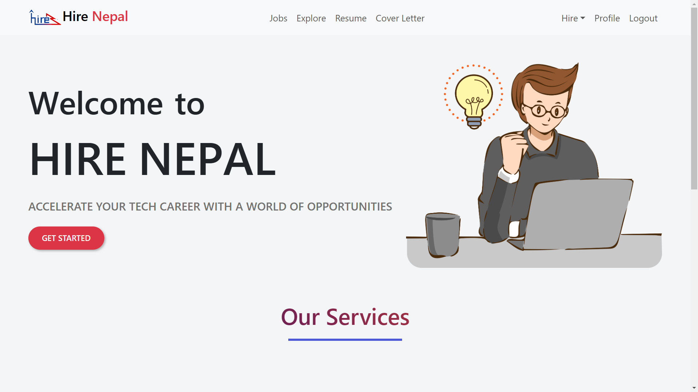
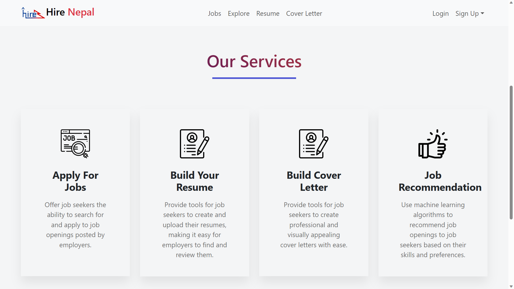
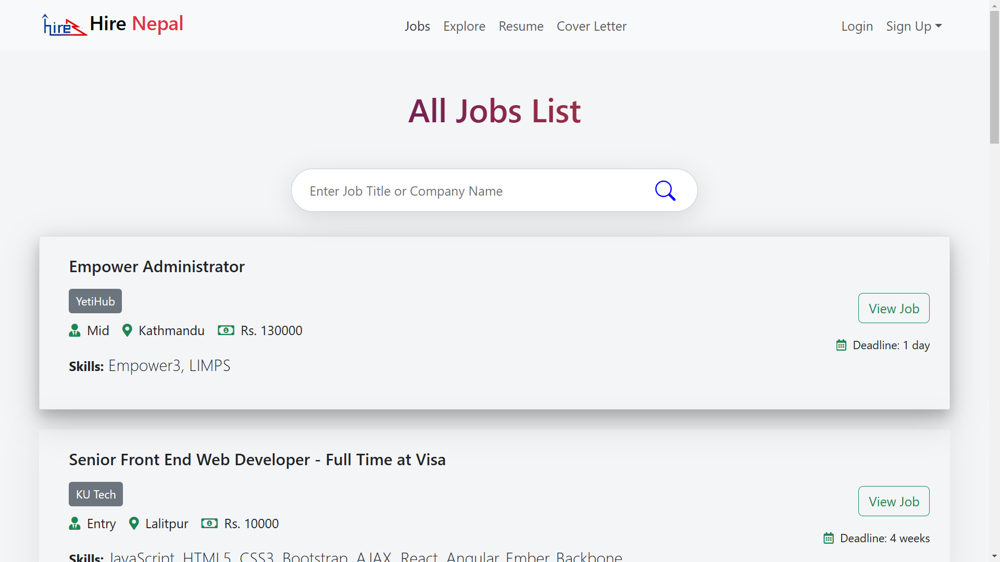
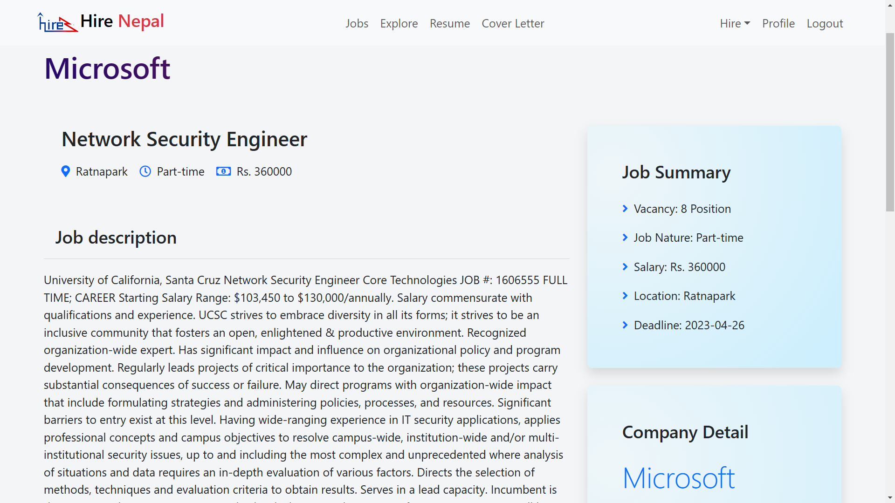
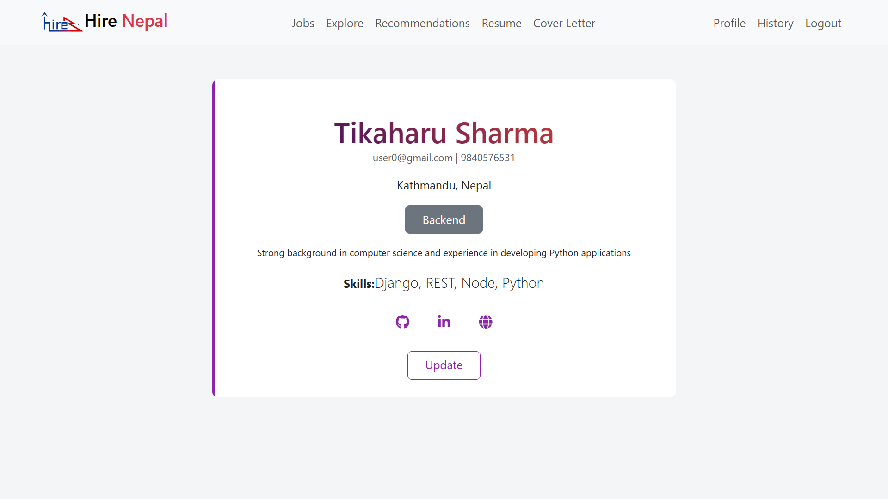
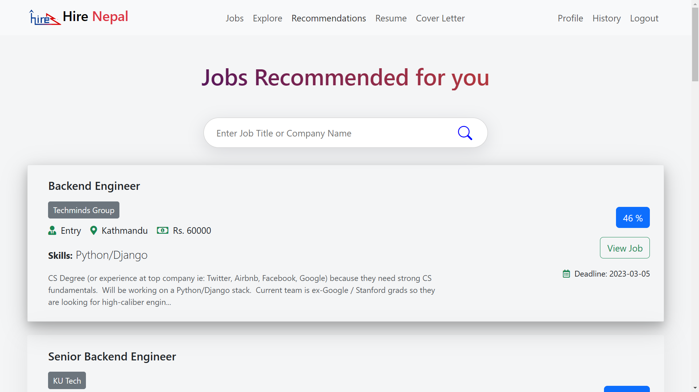
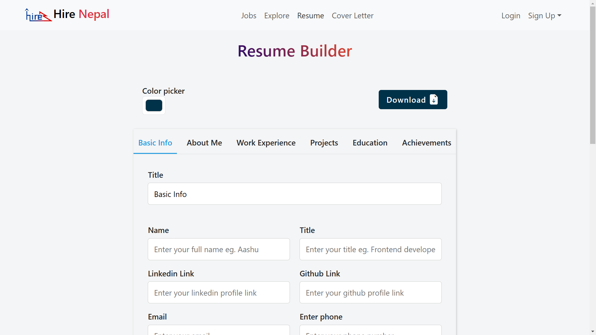
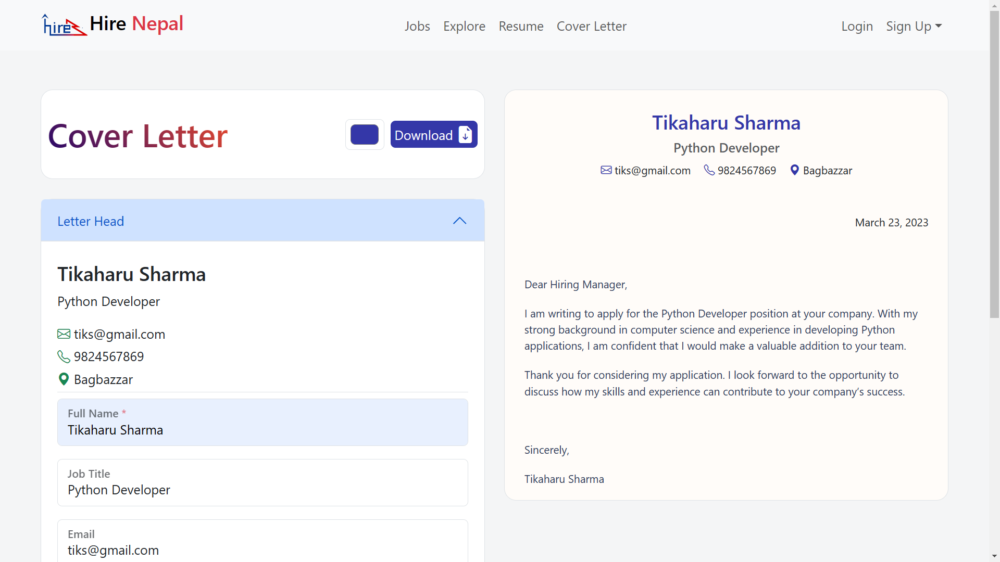

# Hire Nepal

A Job Portal website for finding your dream job in Nepal.  
This project was developed as part of a Bachelor's in Computer Engineering (Third year) Minor Project.

## Features

- Job Listings: Browse through the latest job postings from top companies in Nepal.
- Job Recommendations: Get personalized job recommendations based on your profile and preferences using machine learning.
- Easy Apply: Apply for a job with just a few clicks.
- Employer Dashboard: Manage your job postings and applicants from a single platform.
- Custom Resume Generator: Generate a professional resume tailored to the job you are applying for.
- Cover Letter Generator: Generate a personalized cover letter to accompany your resume.

## Project Setup

To run this app locally, clone this repo and install the dependencies.

```bash
git clone https://github.com/The-SP/Job-Portal-Frontend.git
cd Job-Portal-Frontend
npm install
```

## Backend

[Backend Repo Link](https://github.com/The-SP/Job-Portal-Backend)  
You can use the link above to access the code for the backend api of the project.

## Screenshots

<table>
  <tr>
    <td>Homepage</td>
    <td>Services</td>
  </tr>
  <tr>
    <td></td>
    <td></td>
  </tr>
  <tr>
    <td>Job List</td>
    <td>Job Detail</td>
  </tr>
  <tr>
    <td></td>
    <td></td>
  </tr>
  <tr>
    <td>Profile</td>
    <td>Job Recommendation</td>
  </tr>
  <tr>
    <td></td>
    <td></td>
  </tr>
  <tr>
    <td>Resume Builder</td>
    <td>Cover Letter Builder</td>
  </tr>
  <tr>
    <td></td>
    <td></td>
  </tr>
</table>
